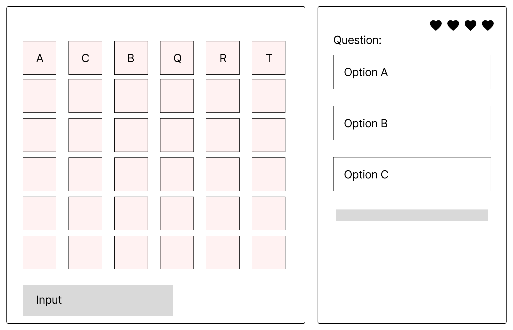

# Wordle +
Play the game on `desktop` or `mobile` : https://lamefreak.github.io/ra-project1-frontend/

## Introduction
Wordle+ is a Wordle and trivia quiz mashup for people who enjoy picking up general knowledge while having fun 🥳 Currently, the app supports a question bank of 30 trivia questions. In the future, themed games may be created with the objective of educating users on specific topics such as finance. As an example, a CPF-version (_CPF stands for Central Provident Fund_) of Wordle+ will help young adults to learn more about Singapore's mandatory savings and pension plan.

Wordle+ is built with React, TailwindCSS, Vite and Framer Motion.

## Wireframes


## Getting Started
Fork and clone the repo to your local machine.
```
git clone https://github.com/LAMEfreak/ra-project1-frontend.git
```
This project was created using with Vite. In the project directory, run the following commands:

`npm install`

`npm run dev`

To see the rendered output, open http://localhost:5173 in the browser of your choice.

## How To Play
- A random 5-letter mystery word is chosen at random. The player has 6 guesses to identify the mystery word.
- The player also has 4 lives 💗 To earn a guess at the mystery word without losing a life, 2 trivia questions must be answered correctly.
- If a question is answered incorrectly, the player gets to earn a guess at the mystery word at the cost of 1 life 💗
- The player wins if the mystery word is identified within 6 guesses and before all lives 💗 are lost.

Tile colors:
| Tile color    | Details                                      |
| ------------- |:--------------------------------------------:| 
| Green         | Letter is in the correct position            | 
| Orange        | Letter is in the wrong position              | 
| Dark Gray     | Mystery word does not contain this letter    |  

## Future Enhancements
- Button to reset Wordle+ game
- Explore specific themed games
